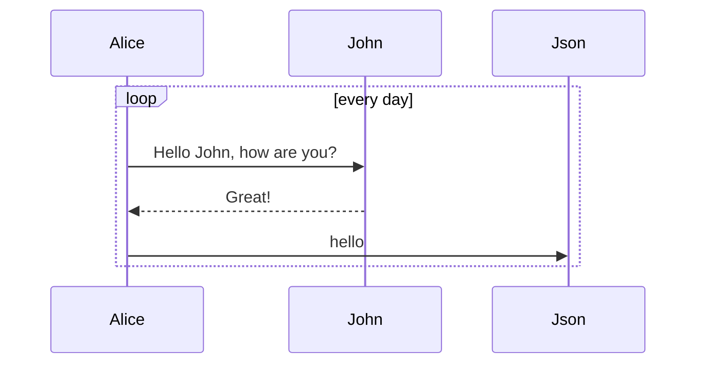

# Overview

The UMF REST API uses HTTP methods and a RESTful endpoint structure. The API authorization framework is OAuth 2.0. You format requests in JSON and the APIs return JSON-formatted responses.

<aside class="notice">
Important: You cannot run the sample requests in this guide as-is. Replace call-specific parameters, such as tokens and IDs, with your own values.
</aside>

## API operations

Use the PayPal REST APIs in these environments:

Environment	Description	Endpoint
Sandbox	Test. Use your test credentials to generate an access token to make calls to the Sandbox URIs.	https://api.sandbox.paypal.com
Live	Production. Use your live credentials to generate an access token to make calls to the live URIs.	https://api.paypal.com
Note: For the PayPal NVP and SOAP API endpoints, see NVP/SOAP API endpoints.
To construct a REST call, combine:

The HTTP method
The full URI to the resource
HTTP headers, if required
The JSON-formatted payload, if required
For example, this request creates a payment:

## Sequence diagram

